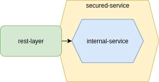

# secured-service
Adding security layer to basic service

## Table of contents
* [General information](#general-information)
* [Architecture design](#architecture-design)
* [Technologies](#technologies)
* [Setup](#setup)
* [Execution](#execution)
* [Test](#test)
* [References](#reference)

## General information

## Architecture design
The architecture is work in progress



## Technologies
Project is created with:
* Java (JDK 17)
* Spring Boot (3.1.1)
* Spring Security (6.1.1)

## Setup
To download dependencies and build the service use the next:
```shell
./gradlew build
```

## Execution
To start the service use the next:
```shell
./gradlew bootRun
```

## Test
To test the service you can use the next:
```shell
curl -v -u user:$user-pwd-generated http://localhost:8080/greeting
```

## Reference
List of reference used to address this project:
* link